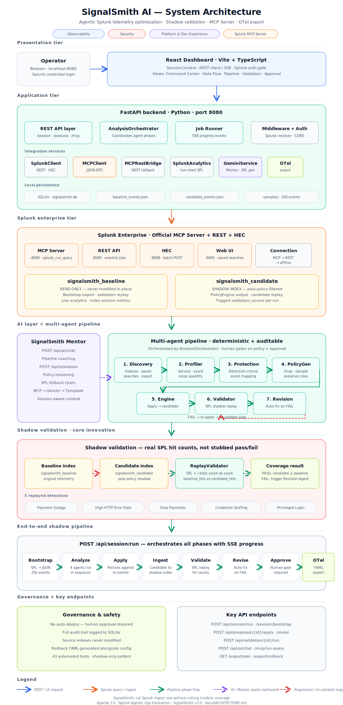

# SignalSmith AI

**Cut Splunk ingest cost without cutting incident coverage.**

[](LICENSE)
[](https://splunkbase.splunk.com/app/7931)
[](#testing)
[](https://splunk.devpost.com/)

SignalSmith is an **agentic telemetry optimization platform** for Splunk Enterprise. It connects to your indexes through the official **Splunk MCP Server**, profiles operational telemetry, generates ingest-reduction policies, validates them with **shadow replay** against your saved searches, and exports OpenTelemetry collector configuration — only after human approval.

Works with **any Splunk workload**: application logs, security alerts, Kubernetes events, network telemetry, metrics, and custom SPL detections.

**Built for:** [Splunk Agentic Ops Hackathon](https://splunk.devpost.com/) — Observability · Security · Platform & Developer Experience



---

## Table of contents

- [The problem](#the-problem)
- [The solution](#the-solution)
- [Key capabilities](#key-capabilities)
- [Who it is for](#who-it-is-for)
- [Architecture overview](#architecture-overview)
- [Installation](#installation)
- [Configuration](#configuration)
- [Running SignalSmith](#running-signalsmith)
- [Splunk integration](#splunk-integration)
- [Custom detections](#custom-detections)
- [Agent pipeline](#agent-pipeline)
- [SignalSmith Mentor](#signalsmith-mentor)
- [Governance and safety](#governance-and-safety)
- [Application views](#application-views)
- [API reference](#api-reference)
- [Project structure](#project-structure)
- [Testing](#testing)
- [Documentation](#documentation)
- [License](#license)

---

## The problem

Organizations ingest massive volumes of telemetry into Splunk — health checks, debug heartbeats, routine success logs, duplicate metrics. Every gigabyte has a cost. Teams need to reduce ingest, but blind filtering is dangerous: one bad policy can silence payment-outage alerts, credential-stuffing detections, or SLO breach monitors.

Traditional approaches rely on trust. SignalSmith relies on **proof**.

---

## The solution

SignalSmith implements a **shadow pipeline** — optimize on a candidate index, prove safety on real SPL, deploy at the source.

```
Baseline index (read-only)
        │
        ▼
   8-agent analysis ──► reduction policies
        │
        ▼
Candidate index (shadow) ──► filtered telemetry
        │
        ▼
Saved-search replay (MCP SPL) ──► baseline vs candidate hit counts
        │
        ├── FAIL ──► Revision Agent auto-corrects ──► re-validate
        │
        └── PASS ──► human approval ──► OTel collector YAML export
```

Your production source indexes are **never modified in place**. All policy changes are tested on shadow data first.

---

## Key capabilities

| Capability | Description |
|------------|-------------|
| **Splunk MCP Server** | JSON-RPC queries, index discovery, saved-search listing, live SPL replay |
| **Multi-agent pipeline** | Eight coordinated agents from discovery through validation and revision |
| **Shadow validation** | Real hit counts per saved search — baseline vs candidate, not pass/fail guesses |
| **Automatic revision** | Policies self-correct when detection coverage regresses |
| **SignalSmith Mentor** | In-product SPL coaching and pipeline guidance grounded in live session state |
| **Human governance** | Approval gate, full audit trail, OTel + rollback YAML export |
| **Universal workloads** | Any indexes, any SPL detections, any log source |

---

## Who it is for

| Role | Value |
|------|-------|
| **Platform / SRE** | Reduce noise from health checks, debug logs, and routine 200s while protecting incident signals |
| **Security / SOC** | Optimize verbose audit trails without breaking brute-force, auth, or ES-style detections |
| **FinTech / SaaS** | Cut application log volume while preserving outage, latency, and fraud alerts |
| **NetOps** | Filter routine SNMP and link-up chatter while keeping firewall deny and outage patterns |
| **Splunk admins** | Evidence-backed ingest policies with measurable byte reduction and SPL proof |

---

## Architecture overview

SignalSmith runs as a single application on **port 8080** — React dashboard and FastAPI backend together.

| Tier | Technology | Role |
|------|------------|------|
| **Presentation** | React · TypeScript · Vite | Operator dashboard, pipeline control, Mentor chat |
| **Application** | Python · FastAPI · Pydantic | REST API, agent orchestration, job runner |
| **Persistence** | SQLite + JSON | Analyses, proposals, validations, audit trail, event datasets |
| **Splunk** | MCP Server · REST · HEC | Query, ingest, saved-search replay |
| **AI assist** | SignalSmith Mentor | Natural-language SPL and session-aware coaching |

Full diagram: [signalsmith_architecture.svg](signalsmith_architecture.svg) · Detailed design: [docs/ARCHITECTURE.md](docs/ARCHITECTURE.md)

---

## Installation

### Prerequisites

| Requirement | Version / notes |
|-------------|-----------------|
| Splunk Enterprise | Trial or [Developer License](https://dev.splunk.com/) |
| Splunk MCP Server | [Splunkbase app 7931](https://splunkbase.splunk.com/app/7931) — recommended |
| Python | 3.9 or later |
| Node.js | 20 or later |
| OS | Windows (PowerShell) or Linux / macOS (bash) |

### Windows

```powershell
git clone https://github.com/YOUR_USER/signalsmith-ai.git
cd signalsmith-ai

.\scripts\setup.ps1          # install dependencies, create .env
.\scripts\install_mcp.ps1    # install Splunk MCP Server
.\scripts\start.ps1         # build UI, start on port 8080
```

### Linux / macOS

```bash
git clone https://github.com/YOUR_USER/signalsmith-ai.git
cd signalsmith-ai

./scripts/setup.sh
./scripts/start.sh
```

Install Splunk MCP Server manually from Splunkbase if not on Windows.

Open **http://localhost:8080** and authenticate with your Splunk credentials.

---

## Configuration

Copy the environment template and edit for your Splunk instance:

```powershell
copy .env.example .env
```

### Essential variables

| Variable | Purpose | Example |
|----------|---------|---------|
| `SPLUNK_USERNAME` | Splunk admin user | `admin` |
| `SPLUNK_PASSWORD` | Splunk password | your password |
| `SPLUNK_WEB_PORT` | Splunk Web UI port | `8005` |
| `SPLUNK_API_PORT` | REST API / MCP port | `8090` |
| `SPLUNK_MCP_URL` | MCP endpoint from Splunk MCP Server page | `https://localhost:8090/services/mcp` |
| `SPLUNK_MCP_TOKEN` | Encrypted MCP token | from Splunk MCP admin |
| `SPLUNK_BASELINE_INDEX` | Source index to read | `your_app_index` |
| `SPLUNK_CANDIDATE_INDEX` | Shadow index for filtered data | `your_shadow_index` |
| `SPLUNK_HEC_TOKEN` | Optional — faster ingest via HEC | HEC token |
| `PROFILE_EXPORT_LIMIT` | Max events per bootstrap export | `25000` |

### Detection configuration

| Variable | Purpose |
|----------|---------|
| `SIGNALSMITH_DETECTIONS_FILE` | Path to custom detection JSON (default: `config/detections.json`) |
| `SIGNALSMITH_INCLUDE_DEMO_DETECTIONS` | Include built-in detections (`true` / `false`) |

### Mentor (optional)

| Variable | Purpose |
|----------|---------|
| `GEMINI_API_KEY` | Enables SignalSmith Mentor natural-language coaching |
| `GEMINI_MODEL` | Model name (default: `gemini-2.0-flash`) |
| `GEMINI_ENABLED` | Toggle Mentor (`true` / `false`) |

Complete reference: [.env.example](.env.example) · Setup guide: [docs/SPLUNK_SETUP.md](docs/SPLUNK_SETUP.md)

---

## Running SignalSmith

### First pipeline run

1. Open **http://localhost:8080**
2. Sign in with Splunk credentials
3. Click **Run pipeline** in the sidebar
4. Monitor progress in **Data Flow**
5. Review hit counts in **Validation**
6. Approve and export OTel YAML in **Approval**

### CLI (optional)

```powershell
cd backend
python -m app.cli health
python -m app.cli integrations
python -m app.cli bootstrap
python -m app.cli run
```

### Verify Splunk connectivity

```powershell
cd backend
python scripts/check_mcp.py
python scripts/check_splunk.py
```

---

## Splunk integration

### Connection modes

SignalSmith selects the best available path automatically:

| Mode | When active | Query path |
|------|-------------|------------|
| `splunk_mcp` | MCP Server responds to `initialize` | JSON-RPC `tools/call` → `splunk_run_query` |
| `splunk_api` | MCP unavailable, REST reachable | MCPRestBridge → Splunk REST oneshot jobs |
| `offline` | Splunk unreachable | Local JSON replay with UI label |

### Indexes (shadow pattern)

| Index | Role |
|-------|------|
| **Baseline** | Read-only source telemetry — bootstrap export and validation baseline |
| **Candidate** | Shadow index receiving post-policy filtered events |

### Protocols

| Protocol | Port (typical) | Used for |
|----------|----------------|----------|
| MCP Server | 8090 | Primary SPL queries, saved-search discovery |
| REST API | 8089 / 8090 | Index management, oneshot searches, fallback |
| HEC | 8088 | High-throughput event ingest |
| Web UI | 8000 / 8005 | Operator verification in Splunk |

### Saved-search discovery

Discovery Agent loads saved searches in priority order:

1. Splunk MCP Server (`list_saved_searches`)
2. Splunk REST API
3. `config/detections.json` (custom)
4. Built-in detection catalog (fallback)

Validation wraps each detection SPL with `| stats count as count` for accurate aggregate replay through MCP.

---

## Custom detections

Point SignalSmith at your own SPL — not limited to any specific schema or industry.

### Step 1 — Create detection file

```powershell
copy config\detections.example.json config\detections.json
```

### Step 2 — Define your SPL

Use `$INDEX$` as a placeholder — replaced with baseline or candidate index during replay:

```json
{
  "detections": [
    {
      "id": "high_error_rate",
      "name": "High Error Rate",
      "spl_template": "index=$INDEX$ level=ERROR",
      "importance": "critical",
      "trigger_threshold": 10
    }
  ]
}
```

### Step 3 — Configure environment

```env
SPLUNK_BASELINE_INDEX=your_production_index
SPLUNK_CANDIDATE_INDEX=your_shadow_index
SIGNALSMITH_INCLUDE_DEMO_DETECTIONS=false
```

Examples for security, Kubernetes, NetOps, and Windows ES: [config/detections.example.json](config/detections.example.json)

Full guide: [config/README.md](config/README.md)

---

## Agent pipeline

Eight specialized agents orchestrated by `AnalysisOrchestrator`:

| # | Agent | Phase | Responsibility |
|---|-------|-------|----------------|
| 1 | **Discovery** | Analyze | Connect to Splunk, inventory indexes and saved searches, bootstrap export |
| 2 | **Profiler** | Analyze | Quantify noise by service, event type, scenario, and field cardinality |
| 3 | **Protection Map** | Analyze | Map events required by critical detections — prevent unsafe drops |
| 4 | **Policy Generator** | Analyze | Produce drop, sample, and preserve rules with SPL evidence and byte estimates |
| 5 | **Policy Engine** | Apply | Apply policies to baseline events → candidate dataset |
| 6 | **Replay Validator** | Validate | Execute saved-search SPL on baseline vs candidate via MCP |
| 7 | **Revision** | Revise | Remove failing rules and re-validate when coverage regresses |
| 8 | **SignalSmith Mentor** | Assist | Natural-language SPL, pipeline coaching, session context (any phase) |

Human approval gates exist on policy review and final export. Every agent action is logged to the audit trail.

Trigger the full pipeline: `POST /api/session/run` or **Run pipeline** in the UI.

---

## SignalSmith Mentor

In-product AI assistant for operators:

- Runnable SPL suggestions from natural language
- Pipeline step coaching based on current session state
- Interpretation of validation results and policy impact
- Answers grounded in baseline counts, active proposal, and index context

Mentor is optional — the deterministic agent pipeline and template SPL matchers work without it. The UI displays **SignalSmith Mentor** only; no third-party provider branding.

Configure with `GEMINI_API_KEY` in `.env`. Falls back to template SPL when offline.

---

## Governance and safety

| Control | Behavior |
|---------|----------|
| **Shadow-only writes** | Production source indexes are never modified |
| **Human approval** | Required before OTel YAML export to collectors |
| **Audit trail** | Every agent action recorded in SQLite |
| **Rollback YAML** | Generated alongside collector config for reversal |
| **Revision loop** | Automatic policy correction on validation failure |
| **Connection transparency** | UI labels active Splunk mode (MCP / REST / offline) |

Security details: [docs/SECURITY.md](docs/SECURITY.md)

---

## Application views

| View | Purpose |
|------|---------|
| **Command Center** | Live index volumes, reduction metrics, Splunk connection status |
| **Data Flow** | End-to-end pipeline visualization and integration health |
| **Pipeline** | Step-by-step workflow with progress and gating |
| **Validation** | Per-detection baseline vs candidate hit counts and coverage % |
| **Mentor** | Single-scroll chat with SPL blocks and session-aware guidance |
| **Approval** | Human approve, OTel YAML preview, rollback export |
| **Settings** | Environment and integration configuration |
| **MCP Tools** | MCP Server tool explorer and query history |

---

## API reference

REST API served at `http://localhost:8080/api/`. Interactive docs at `/docs`.

| Endpoint | Method | Purpose |
|----------|--------|---------|
| `/session/run` | POST | Execute full pipeline |
| `/session/bootstrap` | POST | Export baseline from Splunk |
| `/session/status` | GET | Current session state and metrics |
| `/analysis/start` | POST | Run analyze-phase agents |
| `/proposals/{id}/apply` | POST | Apply policies to candidate |
| `/validation/{id}/run` | POST | Shadow validation replay |
| `/validation/{id}/revise` | POST | Auto-revise on failure |
| `/proposals/{id}/approve` | POST | Human approval gate |
| `/proposals/{id}/export/otel` | GET | OpenTelemetry collector YAML |
| `/proposals/{id}/export/rollback` | GET | Rollback configuration YAML |
| `/ai/chat` | POST | SignalSmith Mentor conversation |
| `/mcp/run-query` | POST | Execute SPL via MCP |
| `/splunk/analytics/live` | GET | Live chart data for Command Center |
| `/integrations/status` | GET | MCP / REST / offline mode |
| `/health` | GET | Application health check |

Authentication: Splunk credentials via `X-Splunk-User` and `X-Splunk-Pass` headers after UI login.

---

## Project structure

```
signalsmith-ai/
├── signalsmith_architecture.svg  # System architecture diagram (repo root)
├── architecture.svg              # Same diagram (Devpost alias)
├── LICENSE                   # Apache 2.0
├── README.md                 # This file
├── .env.example              # Environment template
│
├── backend/
│   ├── app/
│   │   ├── agents/           # Pipeline agents (discovery → revision)
│   │   ├── api/              # FastAPI routes
│   │   ├── models/           # Pydantic data models
│   │   └── services/         # Splunk, MCP, Mentor, storage, orchestration
│   ├── requirements.txt
│   └── tests/                # 43 pytest cases
│
├── frontend/
│   └── src/                  # React dashboard
│
├── config/
│   ├── detections.example.json   # Custom SPL templates
│   └── README.md                 # Custom detection guide
│
├── samples/
│   ├── demo_baseline_events.json # Sample telemetry (250 events)
│   └── detections.json           # Sample SPL templates
│
├── scripts/
│   ├── setup.ps1 / setup.sh      # Install dependencies
│   ├── start.ps1 / start.sh      # Build and start application
│   └── install_mcp.ps1           # Splunk MCP Server installer
│
└── docs/
    ├── ARCHITECTURE.md       # System design and data flow
    ├── SPLUNK_SETUP.md       # Splunk and MCP configuration
    ├── TECHNICAL_DESIGN.md   # Components and testing strategy
    └── SECURITY.md           # Governance and credentials
```

---

## Testing

```powershell
cd backend
pip install -r requirements.txt
python -m pytest tests -v
```

**43 tests** covering agents, MCP client, Splunk count extraction, API workflow, and end-to-end validation including the revision loop.

CI runs on push via `.github/workflows/ci.yml`.

```bash
make test    # Linux / macOS
```

---

## Documentation

| Document | Contents |
|----------|----------|
| [docs/ARCHITECTURE.md](docs/ARCHITECTURE.md) | Mermaid diagrams, API map, sequence flows |
| [docs/SPLUNK_SETUP.md](docs/SPLUNK_SETUP.md) | Indexes, MCP, HEC, troubleshooting |
| [docs/TECHNICAL_DESIGN.md](docs/TECHNICAL_DESIGN.md) | Components, validation logic, testing |
| [docs/SECURITY.md](docs/SECURITY.md) | Credentials, governance, production notes |
| [config/README.md](config/README.md) | Custom detections and any Splunk workload |
| [scripts/README.md](scripts/README.md) | Setup, start, and MCP install scripts |
| [signalsmith_architecture.svg](signalsmith_architecture.svg) | Full system diagram |

**Splunk Agentic Ops Hackathon submission:** [docs/SUBMISSION.md](docs/SUBMISSION.md)

---

## License

Apache License 2.0 — see [LICENSE](LICENSE).

---

<p align="center">
  <strong>SignalSmith AI</strong> — evidence-backed Splunk ingest optimization<br/>
  Shadow validate · MCP-powered · Human-governed · Open source
</p>