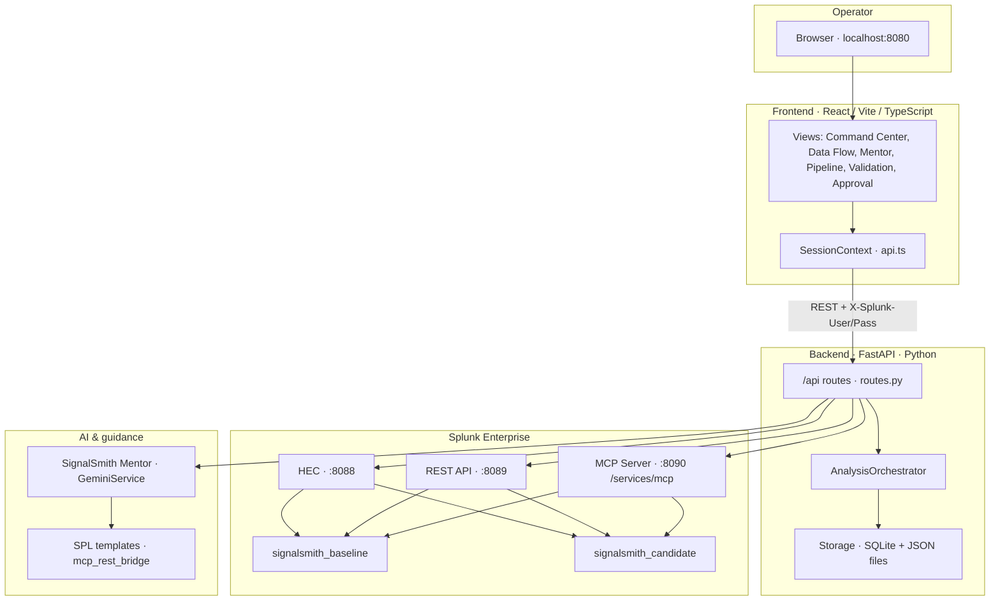
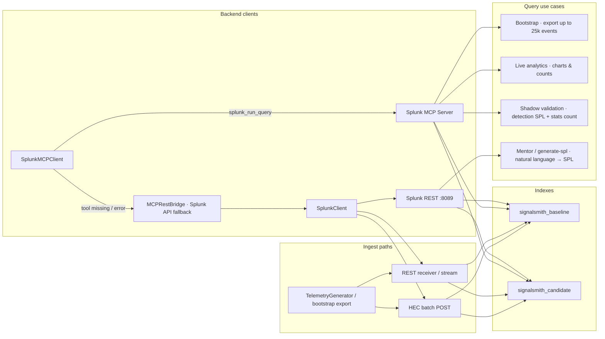
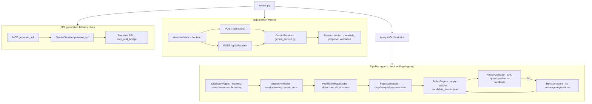
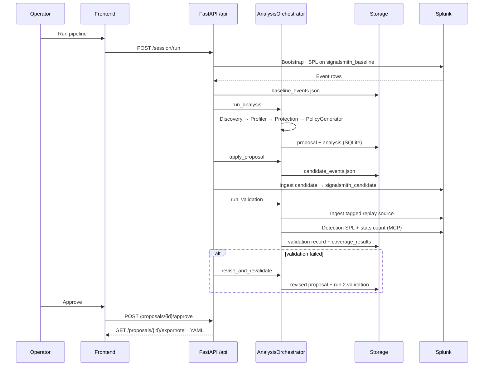
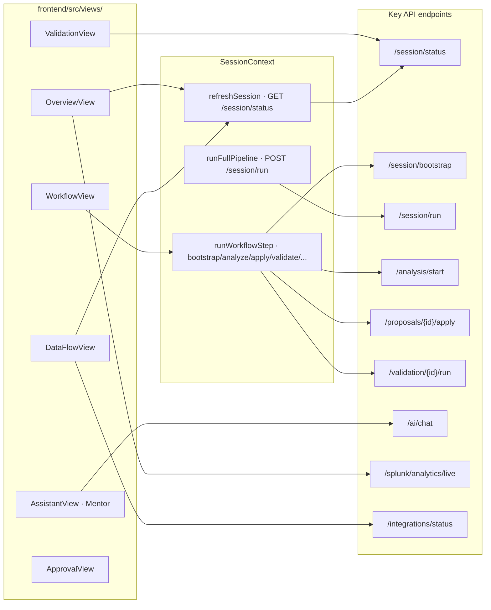

# SignalSmith Architecture

SignalSmith is an agentic telemetry optimization platform. It reads Splunk baseline telemetry, runs a multi-agent analysis pipeline, applies reduction policies to a **shadow candidate** index, validates detection coverage, and exports OpenTelemetry collector YAML after human approval.

**Devpost diagram:** [architecture.svg](../architecture.svg) at repo root (1800×1350, six layers, full legend)

**Related docs:** [README.md](README.md) · [TECHNICAL_DESIGN.md](TECHNICAL_DESIGN.md) · [SPLUNK_SETUP.md](SPLUNK_SETUP.md)

---

## 1. System context

How the operator, frontend, backend, Splunk, and AI layer fit together.



| Layer | Location | Role |
|-------|----------|------|
| Frontend | `frontend/src/` | SPA UI, session state, Splunk auth headers |
| API | `backend/app/api/routes.py` | REST surface for pipeline, Splunk, Mentor, jobs |
| Orchestrator | `backend/app/services/analysis_orchestrator.py` | Coordinates agents and validation |
| Storage | `backend/app/services/storage.py`, `backend/data/` | SQLite + `baseline_events.json` / `candidate_events.json` |
| Splunk clients | `splunk_client.py`, `mcp_client.py`, `mcp_rest_bridge.py` | Query, ingest, MCP JSON-RPC |

---

## 2. Splunk integration

SignalSmith never mutates production source indexes in place. It reads **baseline**, writes a **candidate** shadow index, and replays saved searches on both.



### Connection modes

| Mode | Detection | Query path |
|------|-----------|------------|
| `splunk_mcp` | MCP `initialize` succeeds | `SplunkMCPClient` → JSON-RPC `tools/call` |
| `splunk_api` | MCP unavailable | `MCPRestBridge` → Splunk REST oneshot jobs |
| `offline` | Splunk unreachable | Local JSON replay only |

### Key files

| File | Responsibility |
|------|----------------|
| `backend/app/services/splunk_client.py` | REST connect, index ensure, HEC/REST ingest, oneshot SPL |
| `backend/app/services/mcp_client.py` | Official Splunk MCP JSON-RPC, tool aliases, call history |
| `backend/app/services/mcp_rest_bridge.py` | Implements MCP tool names via Splunk REST when MCP app absent |
| `backend/app/services/splunk_data_service.py` | Bootstrap export, count parsing, row → `TelemetryEvent` |
| `backend/app/services/splunk_analytics.py` | Live chart queries for Command Center / Analytics |
| `backend/app/services/splunk_dashboard.py` | Deploy Splunk dashboard XML |
| `backend/app/config.py` | `splunk_baseline_index`, `splunk_candidate_index`, host/ports |

### Auth

- Operator logs in via `LoginView` → `POST /api/splunk/auth/login`
- Frontend stores credentials in `sessionStorage`; sends `X-Splunk-User` / `X-Splunk-Pass` on every API call
- Backend resolves auth in `splunk_credentials.py` for REST, MCP, and HEC

---

## 3. AI models and agents

Two categories: **pipeline agents** (deterministic analysis) and **SignalSmith Mentor** (natural-language guidance + SPL).



### Agent catalog

Defined in `backend/app/services/agent_catalog.py`:

| Agent | Phase | Human in loop |
|-------|-------|---------------|
| Discovery Agent | analyze | No |
| Telemetry Profiler | analyze | No |
| Protection Map Builder | analyze | No |
| Policy Generator | analyze | Yes |
| Policy Engine | apply | No |
| Replay Validator | validate | No |
| Revision Agent | revise | Yes |
| SignalSmith Mentor | assist | Yes |

### Mentor behavior

- **Online:** `GeminiService.chat()` with session context (baseline counts, policies, validation results)
- **Offline:** Template SPL via `POST /api/mcp/generate-spl` and local saved-search matchers
- User-facing label is always **SignalSmith Mentor** — no provider names in UI copy

---

## 4. End-to-end data flow

Shadow pipeline: read → analyze → apply → validate → (revise) → approve → export.



### Persistent artifacts

| Artifact | Path / table | Written by |
|----------|--------------|------------|
| Baseline events | `backend/data/baseline_events.json` | Bootstrap / generator |
| Candidate events | `backend/data/candidate_events.json` | PolicyEngine |
| Analysis | SQLite `analyses` | Discovery + profiler pipeline |
| Proposal | SQLite `proposals` | PolicyGenerator |
| Validation | SQLite `validations` | ReplayValidator |
| Audit trail | SQLite `audit` | All agents + Mentor |

---

## 5. Frontend ↔ API map



| View | Primary API calls |
|------|-------------------|
| Command Center (`OverviewView`) | `/session/status`, `/splunk/analytics/live` |
| Data Flow (`DataFlowView`) | `/integrations/status`, `/session/status`, `/audit` |
| Pipeline (`WorkflowView`) | `/session/bootstrap`, `/analysis/start`, `/proposals/.../apply`, `/validation/.../run` |
| Mentor (`AssistantView`) | `/ai/chat`, `/ai/explain`, `/mcp/generate-spl`, `/mcp/run-query` |
| Validation (`ValidationView`) | `/session/status` (coverage_results) |
| Approval (`ApprovalView`) | `/proposals/.../approve`, `/export/otel` |

---

## 6. Repository layout (architecture-relevant)

```
splunk/
├── frontend/src/
│   ├── api.ts                 # HTTP client → /api/*
│   ├── context/SessionContext.tsx
│   ├── views/                 # Page components
│   ├── components/            # ChatMessage, WorkflowStepper, Sidebar, …
│   └── lib/workflow.ts        # Pipeline step gating
├── backend/app/
│   ├── main.py                # FastAPI app, serves frontend/dist
│   ├── api/routes.py          # All REST endpoints
│   ├── agents/                # Pipeline agents
│   ├── services/              # Splunk, MCP, Mentor, storage, jobs
│   └── models/                # Pydantic records
├── backend/data/
│   ├── signalsmith.db
│   ├── baseline_events.json
│   └── candidate_events.json
├── docs/
│   ├── ARCHITECTURE.md        # This file
│   └── architecture.svg       # Static diagram
└── scripts/                   # setup, start, install_mcp only
```

---

## 7. Static diagram

The repo-root [architecture.svg](../architecture.svg) is the **Devpost submission diagram** (1800×1350). It includes:

- **Four tiers:** Presentation (React UI) · Application (FastAPI + agents) · Splunk Enterprise (MCP/REST/HEC) · Governance
- **All 8 agents** with phases, human gates, and the revision feedback loop
- **Shadow validation** detail: baseline vs candidate replay, `stats count`, and all 5 detections
- **End-to-end pipeline:** Bootstrap → Analyze → Apply → Ingest → Validate → Revise → Approve → OTel YAML
- **Connection modes:** `splunk_mcp` · `splunk_api` · `offline`
- **Legend** for data flows, MCP integration, AI layer, and impact

For slides or print, open [architecture.svg](architecture.svg) in this folder (same file as repo root).